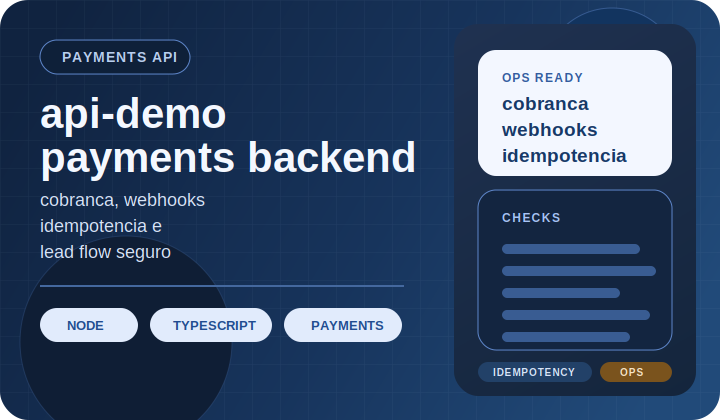

  

<table>
  <tr>
    <td width="33%" valign="top">
      <strong>Perfil</strong>
       
      Senior full stack com foco em produto, APIs, billing e automacao em operacao real.
    </td>
    <td width="34%" valign="top">
      <strong>Atuacao</strong>
       
      Sistemas para aquisicao, checkout, backoffice e integracoes usados por clientes e times internos.
    </td>
    <td width="33%" valign="top">
      <strong>Disponibilidade</strong>
       
      Oportunidades senior, consultoria tecnica e parcerias de produto.
    </td>
  </tr>
</table>

## Onde eu gero valor

<table>
  <tr>
    <td width="33%" valign="top">
      <strong>Receita e conversao</strong>
       
      Jornadas de captacao, catalogo, matricula, checkout e CRM conectadas ao uso real.
    </td>
    <td width="33%" valign="top">
      <strong>APIs que sustentam operacao</strong>
       
      Autenticacao, integracoes, observabilidade, idempotencia e desenho orientado a producao.
    </td>
    <td width="33%" valign="top">
      <strong>Ferramentas para times</strong>
       
      Backoffice, automacao e fluxos com IA para reduzir atrito operacional e tempo manual.
    </td>
  </tr>
</table>

## Showcase publico

  
  

  
  

Demos externas: [Escola Front](https://escola-tecnica-demo-front.vercel.app) · [BotAssist](https://botassist.ruas.dev.br)

 

  
Ver mais repositorios publicos

   
  <a href="https://github.com/N1ghthill/meu-site">meu-site</a> ·
  <a href="https://github.com/N1ghthill/merlin-ia">merlin-ia</a> ·
  <a href="https://github.com/N1ghthill/ruas-links">ruas-links</a> ·
  <a href="https://github.com/N1ghthill/web-analyzer-cli">web-analyzer-cli</a>

## Sistemas em operacao fora do GitHub

- Sistemas privados para captacao, matricula, billing e operacao comercial.
- APIs com autenticacao, observabilidade, idempotencia e integracoes entre times e fornecedores.
- Ferramentas internas e automacao com IA para reduzir trabalho manual em operacao.

## Stack recorrente

  
  
  
  
  
  
  
  
  
  

## Disponibilidade

- Consultoria tecnica para produtos com APIs criticas, billing, jornadas de venda e automacao.
- Apoio senior em arquitetura, execucao e estabilizacao de sistemas em operacao.
- Atuacao senior ou fractional quando a necessidade mistura tecnologia, negocio e operacao.
