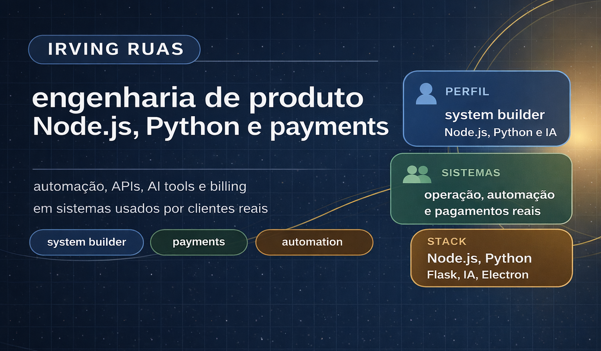

  

  <table>
    <tr>
      <td width="33%" valign="top" align="center">
        <strong>🧑‍💻 Perfil</strong> 
        Senior full stack com foco em produto, APIs, billing e automação em operação real.
      </td>
      <td width="34%" valign="top" align="center">
        <strong>⚙️ Atuação</strong> 
        Sistemas para aquisição, checkout, backoffice e integrações usados por clientes e times internos.
      </td>
      <td width="33%" valign="top" align="center">
        <strong>📌 Disponibilidade</strong> 
        Oportunidades senior, consultoria técnica e parcerias de produto.
      </td>
    </tr>
  </table>

---

## 🎯 Onde gero valor

  <table>
    <tr>
      <td width="33%" valign="top">
        <strong>💰 Receita e conversão</strong> 
        Jornadas de captação, catálogo, matrícula, checkout e CRM conectadas ao uso real.
      </td>
      <td width="33%" valign="top">
        <strong>🔌 APIs que sustentam operação</strong> 
        Autenticação, integrações, observabilidade, idempotência e desenho orientado a produção.
      </td>
      <td width="33%" valign="top">
        <strong>🛠️ Ferramentas para times</strong> 
        Backoffice, automação e fluxos com IA para reduzir atrito operacional e tempo manual.
      </td>
    </tr>
  </table>

---

## 📂 Projetos públicos

Projetos públicos que mostram como transformo aquisição, cobrança e operação em sistemas usáveis no dia a dia.

### Captação e jornada comercial

**[Escola Técnica Demo Front](https://github.com/N1ghthill/escola-tecnica-demo-front)** 
Fluxo público pensado para transformar tráfego em lead qualificado e matrícula. 
`HTML` · `CSS` · `JavaScript` · `Vercel` 
🌐 [Demo ao vivo](https://escola-tecnica-demo-front.vercel.app)

**[Escola Técnica Demo API](https://github.com/N1ghthill/escola-tecnica-demo-api)** 
Backend para organizar catálogo, registrar intenção e dar visibilidade à jornada comercial. 
`Node.js` · `TypeScript` · `Express`

### Cobrança, operação e automação

**[api-demo](https://github.com/N1ghthill/api-demo)** 
Base transacional para cobrança e eventos críticos com consistência operacional. 
`Node.js` · `TypeScript` · `Express`

**[BotAssist WhatsApp](https://github.com/N1ghthill/botassist-whatsapp)** 
Ferramenta interna para acelerar atendimento, padronizar operação e reduzir trabalho manual. 
`Electron` · `Baileys` · `IA` 
🌐 [Site](https://botassist.ruas.dev.br)

  
📌 Ver mais repositórios públicos

   
  <a href="https://github.com/N1ghthill/meu-site">meu-site</a> ·
  <a href="https://github.com/N1ghthill/merlin-ia">merlin-ia</a> ·
  <a href="https://github.com/N1ghthill/ruas-links">ruas-links</a> ·
  <a href="https://github.com/N1ghthill/web-analyzer-cli">web-analyzer-cli</a>

---

## 🧰 Sistemas privados em operação

- 🏢 Sistemas privados para captação, matrícula, billing e operação comercial.
- 🔐 APIs com autenticação, observabilidade, idempotência e integrações entre times e fornecedores.
- 🤖 Ferramentas internas e automação com IA para reduzir trabalho manual em operação.

---

## ⚡ Stack principal

  
  
  
  
  
  
  
  
  
  

---

## 📫 Formatos de atuação

- 💼 Consultoria técnica para produtos com APIs críticas, billing, jornadas de venda e automação.
- 🧠 Apoio senior em arquitetura, execução e estabilização de sistemas em operação.
- 🤝 Atuação senior ou fractional quando a necessidade mistura tecnologia, negócio e operação.
