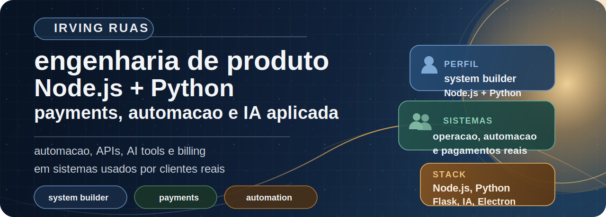
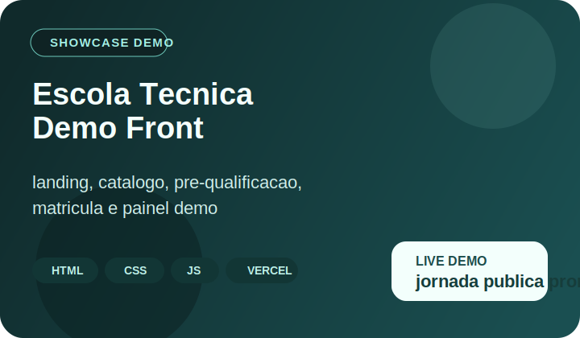
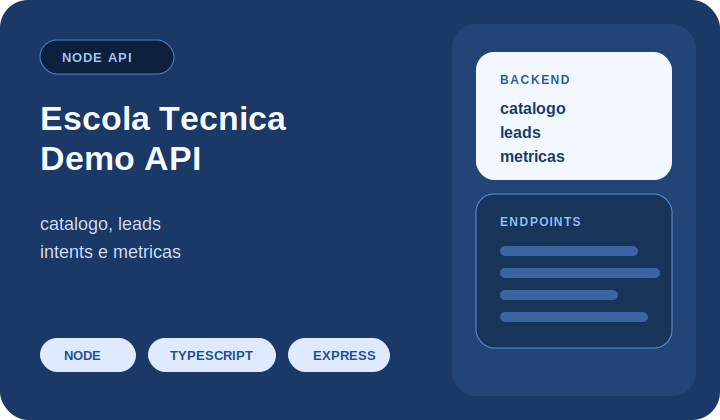
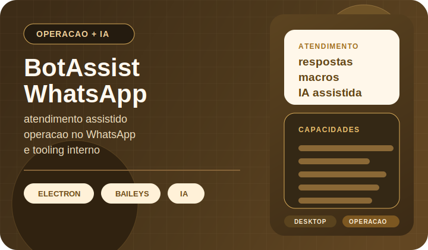
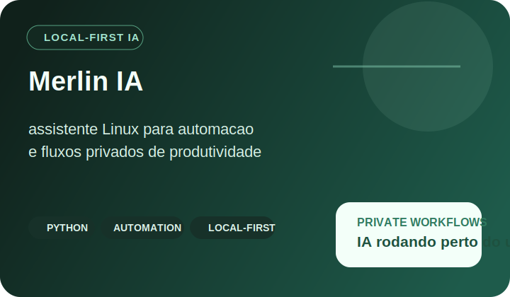

  

<h1 align="center">Irving Ruas</h1>

  Full Stack Engineer focado em produto, APIs, automacao e IA aplicada

  Construo produtos digitais end-to-end com foco em conversao, experiencia do usuario, eficiencia operacional e arquitetura sustentavel.

  
  
  

  
  
  

## Projetos em destaque

<table>
  <tr>
    <td width="50%" valign="top">
      
       
      
        <a href="https://github.com/N1ghthill/escola-tecnica-demo-front">Repositorio</a> ·
        <a href="https://escola-tecnica-demo-front.vercel.app">Demo ao vivo</a>
      
    </td>
    <td width="50%" valign="top">
      
       
      
        <a href="https://github.com/N1ghthill/escola-tecnica-demo-api">Repositorio</a>
      
    </td>
  </tr>
  <tr>
    <td width="50%" valign="top">
      
       
      
        <a href="https://github.com/N1ghthill/botassist-whatsapp">Repositorio</a>
      
    </td>
    <td width="50%" valign="top">
      
       
      
        <a href="https://github.com/N1ghthill/merlin-ia">Repositorio</a>
      
    </td>
  </tr>
</table>

## O que eu construo

- Produtos web do MVP ate a operacao estavel.
- APIs com autenticacao, metricas, integracoes e foco em uso real.
- Funis comerciais com captura de lead, painel interno e automacao.
- Demos publicas organizadas para clientes, vendas e recrutamento.

## Mais repositorios relevantes

- [api-demo](https://github.com/N1ghthill/api-demo): backend tecnico com foco em arquitetura, idempotencia e qualidade operacional.
- [meu-site](https://github.com/N1ghthill/meu-site): portfolio profissional em HTML, CSS e JavaScript.

## Stack recorrente

  
  
  
  
  
  
  
  
  

## Disponibilidade

- Consultoria tecnica para produtos web, funis e automacao.
- Oportunidades senior em engenharia de produto e full stack.
- Projetos que precisem unir execucao tecnica com visao de negocio.
